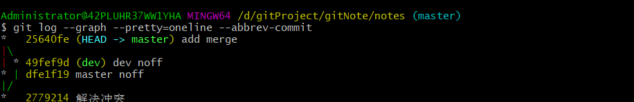

分支管理策略
====

------

## 0x00场景说明

我们分支合并时，git一般采用的是`Fast forword`模式，
但是这种模式下，删除了分支就会丢失分支信息。

如果禁用这种模式，git就会在merge时生成一个新的提交（commit），
这样就算删除了合并了的分支，那个分支的信息也能够看到。

## 0x00实验

1. 我们创建一个noff.txt文件并add，commit，push到远程仓库。

2. **创建并切换**到`dev`分支,之后对noff.txt作以下修改：
```
Today is Thursday and example.
```
保存修改，add并提交。

3. 切换回master分支，修改noff.txt:
```
Today is Thursday & example.

```
保存修改，add并提交。

4. 加上`--no-ff`合并`dev`分支：
```
 git merge --no-ff dev
```
出现冲突，手动修改noff.txt解决冲突:
```
<<<<<<< HEAD
Today is Thursday & example.
=======
Today is Thursday and example.
>>>>>>> dev
```
修改为
```
Today is Thursday && example.
```
add,commit之后，进行合并(此时可以加一个合并说明)：
```
git merge --no-ff -m"no-ff merge noff.txt" dev

```

以图形的方式显示提交日志，以查看这种合并的效果：
```
git log --graph --pretty=oneline --abbrev-commit

```


## 0x01 分支策略

在实际开发中要多使用分支,首先`master`分支应该要非常稳定,
不应该在这上面干活,master分支应该只用来发布最新版本.
我们干活要在自己的工作分支上,然后时不时将结果合并到`dev`上.

## Daily English

>You can't have a better tomorrow if you don't stop thinking about yesterday.
>如果你无法忘怀昨天就不会有一个更好的明天.


