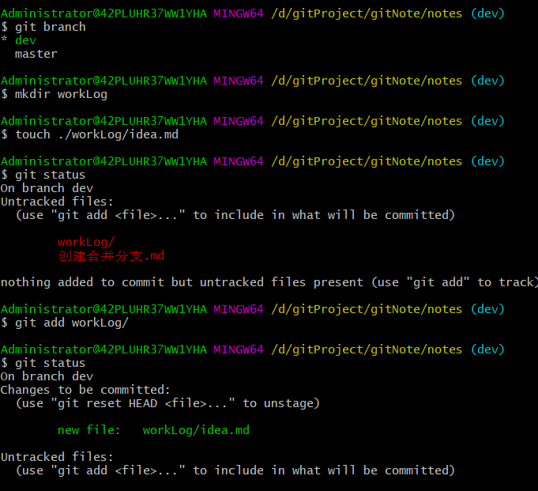
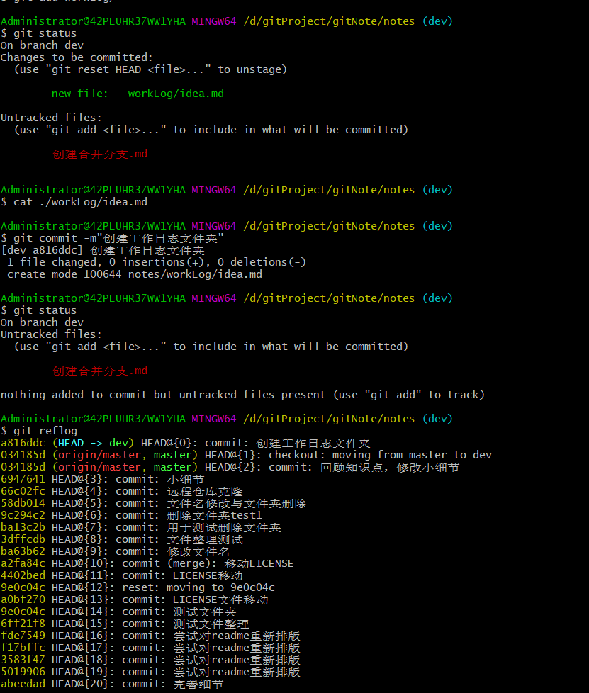
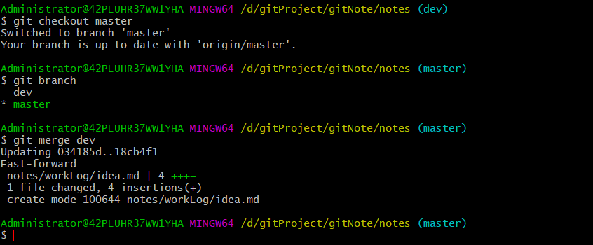

创建合并分支
=

## 0x00 基本概要
（分支是一条的时间线）
我们刚创建仓库时，只有一个`master`分支（`master`为这个分支的头部名称<标识/指针>）,
`HEAD`指针指向的是`master`。`master`指向最新提交，当有新的内容提交，`master`先前移一步，然后`HEAD`再指向`master`。

如果我们有一个新的分支`dev`，`HEAD`指向了`dev`，在`dev`上的工作做完了，
我们需要把`dev`上的内容合并到`master`分支上。
**在这个过程，内部实际是`master`先移到`dev`,然后`HEAD`指向`master`。**
之后可以删除`dev`（因为分支上的内容并不会删除，所以我把分支名称理解为一个标识/指针...）

## 0x01 创建分支

+ 创建分支：`git branch branch_name`
+ 切换分支：`git checkout branch_name`
+ 创建并切换：`git checkout -b branch_name`

## 0x02 合并分支
最终我们希望是只有一个`master`分支(主分支)。
所以要把子分支上的内容合并到`master`。
合并时，我们要先切换回`master`分支，然后输入：
```
git merge branch_name
```
将叫branch_name的分支合并到`master`上。
`（git merge branch_name`是将指定的分支**合并到当前分支**上。）

**最新版的分支合并**：`git switch branch_name`,这个更好理解~

这里提到的合并是git采用的是快进合并（`Fast-forward`）的方式，还有其他方式，后面进一步学习。

## 0x03 删除分支
```
git branch -d branch_name
```
## 0x04 实验
```
$ git checkout -b dev
Switched to a new branch 'dev

```

---

---


---

## 0x05 其他
git鼓励多使用分支，在子分支上工作完成再合并到主分支，
之后再删除合并了的子分支。这样虽然繁琐一些，但是更安全。


