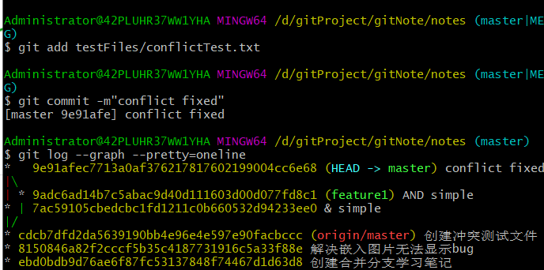
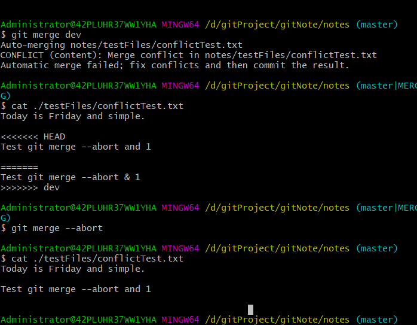

解决冲突
==
$Daily English
>不要憎恨你的敌人，否则你将做出错误的判断。

>Don't hate your enemy,or you will make wrong judgment.

## 0x00 实验
1.在testFiles文件夹下创建一个测试文件,并push到远程仓库

```
touch ./testFiles/conflictTest.txt
git add ./testFiles/conflictTest.txt
git commit -m"创建冲突测试文件"
git push
```
2.创建一个feature1分支，并切换到此分支
```
git checkout -b feature1
```
修改conflictTest.txt：
Today is Friday AND simple.
然后：
```
git add ./testFiles/conflictTest.txt
git commit -m"AND simple"
```

3.切换回master分支

```
git checkout master
```
修改conflictTest.txt：
Today is Friday & simple.
然后：
```
git add ./testFiles/conflictTest.txt
git commit -m"& simple"
```
4.合并分支
```
git merge feature1
 ```
 结果出现冲突：
 ```
 Auto-merging notes/testFiles/conflictTest.txt
CONFLICT (content): Merge conflict in notes/testFiles/conflictTest.txt
Automatic merge failed; fix conflicts and then commit the result.
```
 查看冲突内容（此时文件里的内容）：
 ```
 $ cat ./testFiles/conflictTest.txt
<<<<<<< HEAD
Today is Friday & simple.
=======
Today is Friday AND simple.
>>>>>>> feature1
```
Git用<<<<<<<，=======，>>>>>>>标记出不同分支的内容。
此时需要手动修改冲突，修改为：
Today is Friday and simple.
之后:
```
git add ./testFiles/conflictTest.txt
git commit -m"comflict fixed"
```
可以查看合并情况
```
 git log --graph --pretty=oneline

```

--

之后删除用完的子分支：

```
git branch -d feature1
```

## 0x01 总结
+ 一个已经在远程仓库里的文件，在两个分支上修改，合并时容易出现冲突，
此时需要手动合并冲突。

+ git log --graph：可以看到分支合并图
+ git merge --abort：可以回到解决冲突之前的状态
（在执行git merge branch_name后，冲突文件中会有：<<<<<<<，=======，>>>>>>>标记，
此时执行git merge --abort命令，就可以回到没有执行git merge branch_name时的状态<冲突文件里面没有标记>）


--