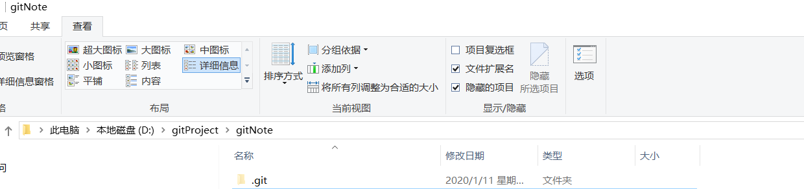

Learn Git Note
=
------

系统学习Git个人笔记

# 0x00 安装Git
略...
<hr>

# 0x01 创建repository

**最好在一个空文件夹下创建仓库**
+ 创建一个空文件夹： `mkdir gitNote`
+ 初始化仓库:Git Bash Here，`git init`
(此时gitNote文件夹下会有一个隐藏的`.git`文件夹)


------
# 0x02 创建readme.txt
```shell
touch readme.txt
```
因为我想用写**markdown**来编写，所以**修改readme.txt为readme.md**
`git mv readme.txt readme.md`
报错：
`fatal: not under version control, source=readme.txt, destination=readme.md`
大概意思就是还没有在版本控制下，现在readme在工作区
你可以直接编辑文件名，你也可以先将readme添加到版本库（此时在暂存区）再用命令行来修改：
```shell
git add readme.txt
git mv readme.txt readme.md
```
我再创建一个文件夹来存放图片：
```
mkdir images
```
------
# 0x03 查看工作区状态
```shell
git status
```
----

# 0x04 把文件添加到版本库
```
//指定文件
git add file_name
//把工作时的所有变化提交到暂存区
git add .
//所有文件
git add -A
```
补充：

`git add.` ：它会监控工作区，会把工作时的所有变化提交到暂存区，
包括文件内容修改(modified)以及新文件(new)，但不包括被删除的文件。
	
`git add -u`（git add --update） ：仅监控已经被add的文件（即tracked file），
会将被修改的文件提交到暂存区，add -u 不会提交新文件（untracked file）。
	
`git add -A` （git add --all）：是上面两者的合集。

------


# 0x05 把文件提交到仓库
```shell
git commit -m"提交说明"
```

......


